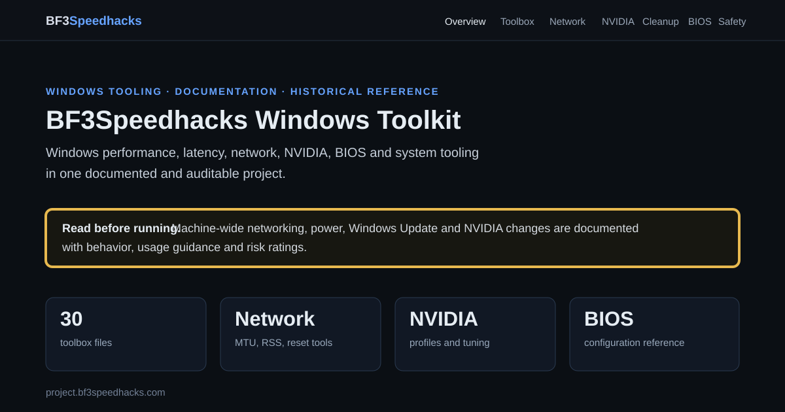

# udp legacy: Windows Toolkit

A consolidated, auditable collection of maintained Windows utilities, Windows workaround documentation, BIOS reference material, configuration files, and preserved historical tweak scripts.

The repository combines the former **udp legacy Windows Workarounds / BIOS** project and the **WFiles** rebuild into one maintained codebase.

## Website

[**Open the BF3Speedhacks Windows Toolkit website**](https://project.bf3speedhacks.com)

[](https://project.bf3speedhacks.com)

> [!WARNING]
> Some files change Windows networking, update policy, BitLocker-related configuration, firewall behavior, hibernation, firmware settings, or other system state. Read the matching documentation before applying changes. Files under `archive/` are historical reference material and are **not recommended for execution on current Windows systems**.

## Repository map

| Path | Purpose |
| --- | --- |
| `scripts/` | Maintained PowerShell tools with validation and safer defaults |
| `toolbox/` | 30 imported utilities from the supplied Amin, Cleanup, Network reset, and NVIDIA archives |
| `source-archives/` | The four supplied 7z archives preserved as received |
| `docs/index.html` | GitHub Pages entry point; publish `/docs` from the `main` branch |
| `docs/WINDOWS_WORKAROUNDS.md` | Windows Workarounds reference |
| `docs/BIOS_CONFIGURATION.md` | BIOS configuration reference |
| `docs/BITLOCKER_TPM_PIN.md` | TPM and BitLocker startup-PIN guidance |
| `docs/SCRIPT_REFERENCE.md` | Reference for maintained and historical WFiles scripts |
| `docs/TOOLBOX_REFERENCE.md` | File-by-file documentation for all 30 imported toolbox items |
| `docs/NVIDIA_REFERENCE.md` | Raw NVIDIA Inspector setting IDs and values for every supplied `.nip` profile |
| `docs/SAFETY_NOTES.md` | Safety and compatibility notes for Windows Workarounds |
| `docs/SAFETY_AUDIT.md` | Audit of older Windows tweak files |
| `configs/` | Importable application configuration |
| `packages/` | Reviewable Chocolatey package manifest |
| `experimental/` | Machine-sensitive changes with rollback material |
| `archive/legacy-workarounds/` | Preserved legacy examples from the Windows Workarounds project |
| `archive/wfiles-original/` | Preserved original WFiles collection |
| `tests/` | Non-destructive repository validation |


## GitHub Pages site

The repository contains a self-contained static site under `docs/`.

GitHub Pages can publish it directly from:

```text
Branch: main
Folder: /docs
```

The site includes:

* a searchable file-by-file Toolbox reference,
* dedicated Network, NVIDIA, Cleanup, BIOS, Legacy, Safety, and Files pages,
* direct copies of maintained tools, imported toolbox files, historical archive files, and the original supplied 7z archives under `docs/files/`,
* `docs/CNAME` for `project.bf3speedhacks.com`,
* no external JavaScript or CSS dependencies.

## Maintained tools

### Inspect Windows tweak state

```powershell
.\scripts\Get-WindowsTweakState.ps1
```

Reads relevant firewall, hibernation, update-policy, boot, and restore-point settings without changing them.

### Create a restore point

```powershell
.\scripts\New-SystemRestorePoint.ps1 -Description "Before Windows change"
```

Uses `Checkpoint-Computer` and does not delete existing Volume Shadow Copy snapshots.

### Configure interface MTU

```powershell
Get-NetIPInterface -AddressFamily IPv4
.\scripts\Set-NetworkMtu.ps1 -InterfaceAlias "Ethernet" -MtuBytes 1492 -WhatIf
.\scripts\Set-NetworkMtu.ps1 -InterfaceAlias "Ethernet" -MtuBytes 1492
```

`1492` is common on PPPoE paths but is not universally optimal. Determine the correct MTU for the actual network path.

### Toggle hibernation

```powershell
.\scripts\Set-Hibernation.ps1 -State Disabled -WhatIf
.\scripts\Set-Hibernation.ps1 -State Disabled
.\scripts\Set-Hibernation.ps1 -State Enabled
```

Disabling hibernation also disables Fast Startup because both depend on `hiberfil.sys`.

### Configure Windows Firewall profiles

```powershell
.\scripts\Set-FirewallProfileState.ps1 -State Enabled
.\scripts\Set-FirewallProfileState.ps1 -State Disabled -Profile Private -WhatIf
.\scripts\Set-FirewallProfileState.ps1 -State Disabled -Profile Private -Force
```

Disabling a firewall profile requires `-Force`. Prefer narrow firewall allow rules over disabling a profile.

### Control drivers in Windows quality updates

```powershell
.\scripts\Set-DriverUpdatePolicy.ps1 -State Excluded -WhatIf
.\scripts\Set-DriverUpdatePolicy.ps1 -State Excluded
.\scripts\Set-DriverUpdatePolicy.ps1 -State Included
```

Changes the documented `ExcludeWUDriversInQualityUpdate` policy only.

### Install selected Chocolatey packages

Review `packages/chocolatey-packages.txt` first:

```powershell
.\scripts\Install-ChocolateyPackages.ps1 -WhatIf
.\scripts\Install-ChocolateyPackages.ps1
```

Chocolatey itself is not bootstrapped automatically.

### Export useful Windows events

```powershell
.\scripts\Export-WindowsEvents.ps1
.\scripts\Export-WindowsEvents.ps1 -Hours 48 -OutputDirectory "$env:USERPROFILE\Downloads"
```

Exports selected Application and System events into UTF-8 text files.

### Target a Windows feature release

```powershell
.\scripts\Set-WindowsFeatureTarget.ps1 -Mode Current -WhatIf
.\scripts\Set-WindowsFeatureTarget.ps1 -Mode Current
.\scripts\Set-WindowsFeatureTarget.ps1 -Mode Remove
```

This targets a Windows feature release. It does not change Home, Pro, Enterprise, or Education licensing edition.

### Inspect BitLocker readiness

```powershell
.\scripts\Get-BitLockerReadiness.ps1
```

Read-only inspection. Protector changes remain manual because deleting or replacing the wrong protector can cause recovery lockout.

## BIOS reference

`docs/BIOS_CONFIGURATION.md` documents the complete BIOS profile from the original project and annotates hardware-specific and security-sensitive settings. Firmware naming and behavior vary by motherboard, BIOS version, CPU, GPU, storage configuration, and enabled Windows security features.


## Imported toolbox

`toolbox/` contains the exact 30 files extracted from the supplied auxiliary archives and reorganized only by function.

`toolbox/MANIFEST.md` records each source archive, original path, byte count, and SHA-256 hash. `docs/TOOLBOX_REFERENCE.md` documents actual behavior, limitations, usage, and risk for every imported file.

Important examples include the physical-adapter network reset with persistent MTU 1492, the orphan-cleanup audit/GUI, global NVIDIA Profile Inspector presets, RSS affinity configuration, power-plan tuning, Windows Update policies, permission context menus, Game Bar/Game DVR changes, input queue registry values, and combined Windows/display presets.

## Historical archive

The two historical collections are intentionally isolated under `archive/`.

They contain old tweaks that may disable or weaken Defender, SmartScreen, Windows Update, UAC, CPU vulnerability mitigations, DEP-related configuration, Hyper-V, firewall profiles, Windows services, recovery data, or other protections. They are retained for traceability and analysis, not as current recommendations.

## Verification

Run the non-destructive static checks from the repository root:

```powershell
.\tests\StaticChecks.ps1
```

GitHub Actions runs the same checks on pushes and pull requests.

## License

Maintained project code and original project documentation are released under the [MIT License](LICENSE), subject to the scope described in [LICENSING.md](LICENSING.md).
